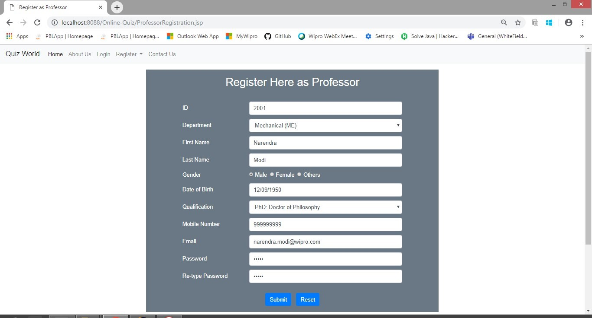
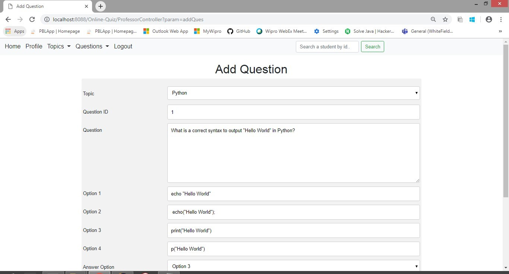
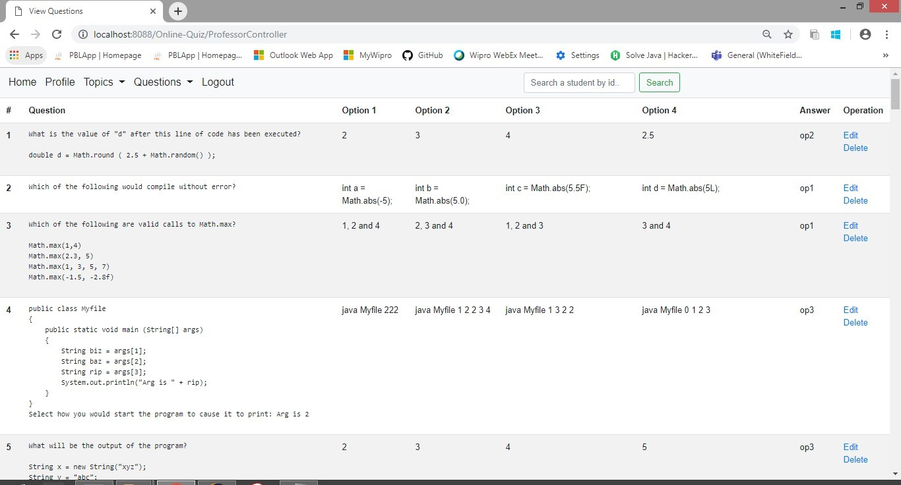
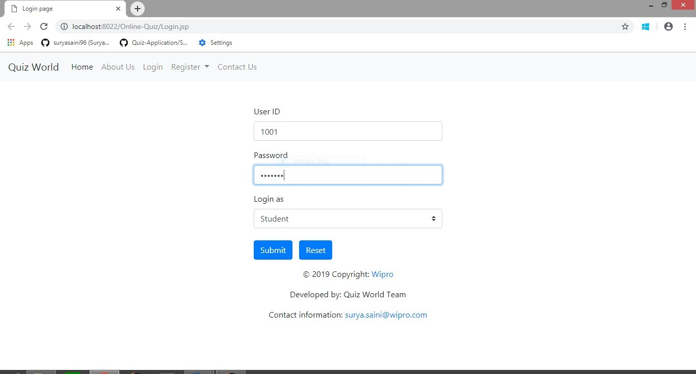
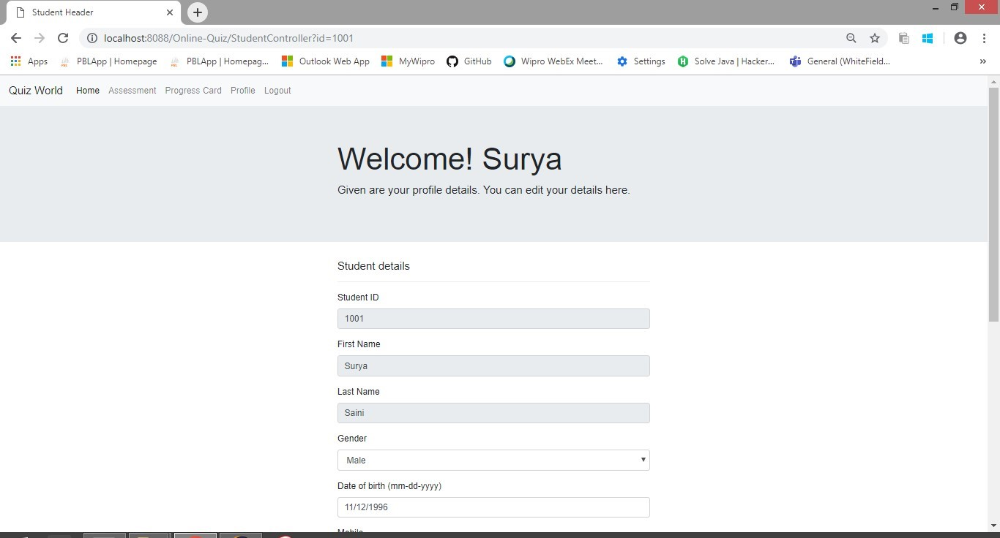
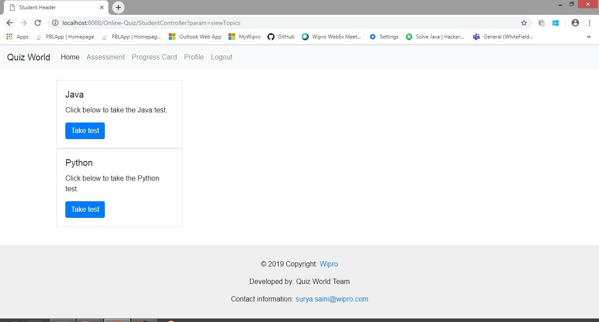
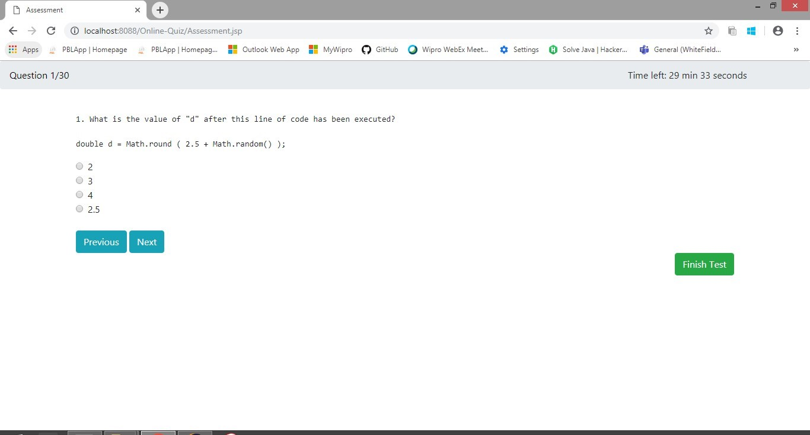
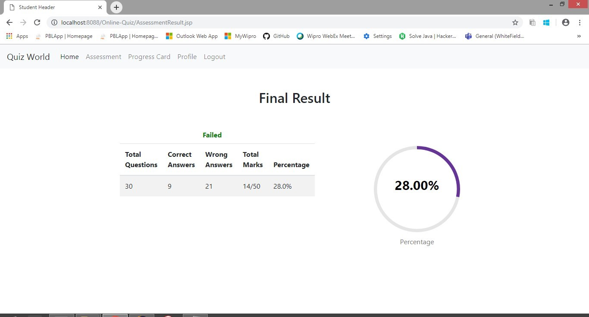
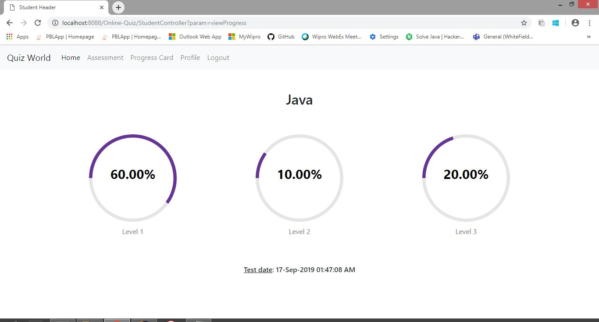

# Quiz-Application

Wipro BOP Project in Online Quiz Application for a college.

An MVC based JSP & Servlet based web application for online assessment for students & professors with an Oracle SQL database. We need to setup the database first by creating the tables, sequences and triggers as mentioned in SQL Queries.txt file in order for application to work.

The webpage UI had many features such as:-

1. Login page for both users.
2. Password reset.
3. Logout from the existing session.
4. User registration.
5. The professor can upload/add questions on a particular topic.
6. The professor can delete/edit a question on a particular topic.
7. The professor can view all the topics and the questions in each topics.
8. The assessment page for student.
9. Previous assessment record for student.

Technologies used:-
* HTML
* CSS
* JavaScript
* Bootstrap
* Java JSP & Servlets
* Oracle SQL

## Image showcase

 
Home Page

 
Professor Registration Page

 
Professor Login Page

 
Add Questions Page

 
View Questions Page

 
Student Registration Page

 
Student Login Page

 
Student Home Page

 
Student Profile Page

 
Topics Page

 
Assessment Page

 
Results Page

 
Report Page

